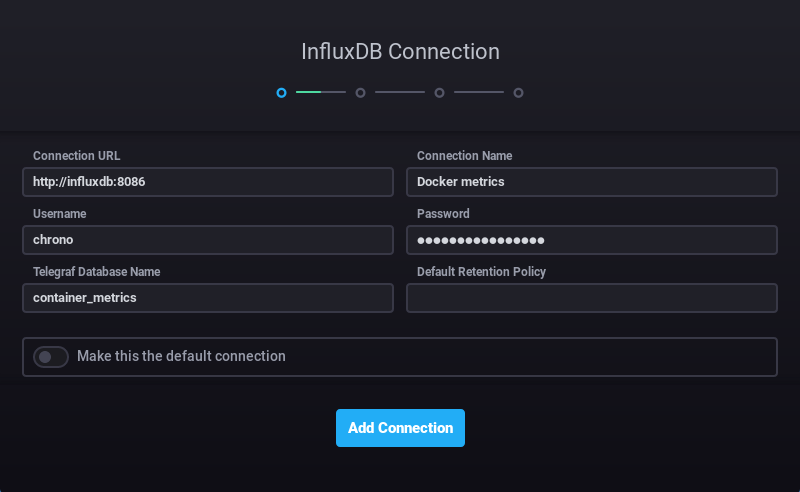
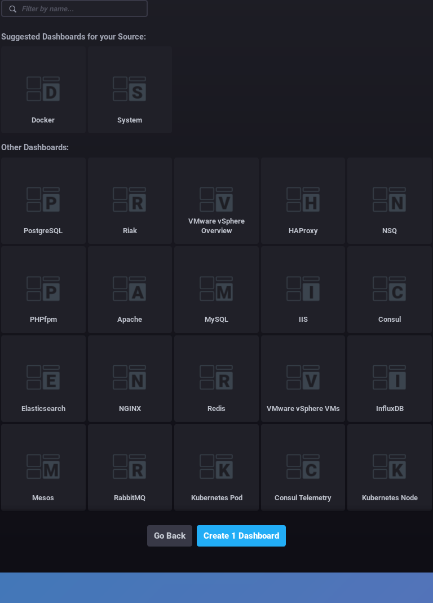
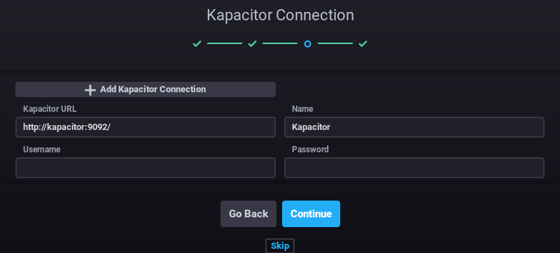
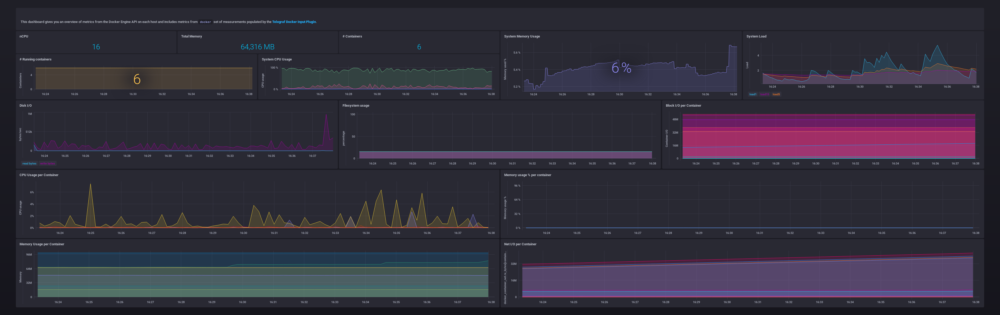

# Docker_Metrics_rough
This composer file creats 4 container 1 network and 1 volume to monitor docker over the API.
And please change the credentials - they are just (very bad) examples.

## The Setup

- Just clone the code to a place of your liking,note that changing the location of individualy may break the composer file.
- Run:
><code>sudo docker-compose -f predefefined.yml up</code>

- NOTE: Other builders are also possible but are not tested.
- We login to chronograf now by using <code> http://localhost:8200 </code>
- We now have to setup a database connection.

As shown above we enter the credentials we have set for chronograf.
Remember to use influxdb:8086 so that docker manges the connection between both conatiners.

Next we select the dashboard, we could create our own but for the moment a predefined is good enough.

Last but not least is the Kapacitor in the given config it has no password or username.

## Outcome
If everything worked out as descired you will be welcomed by something like this.

I hope this helps a bit.